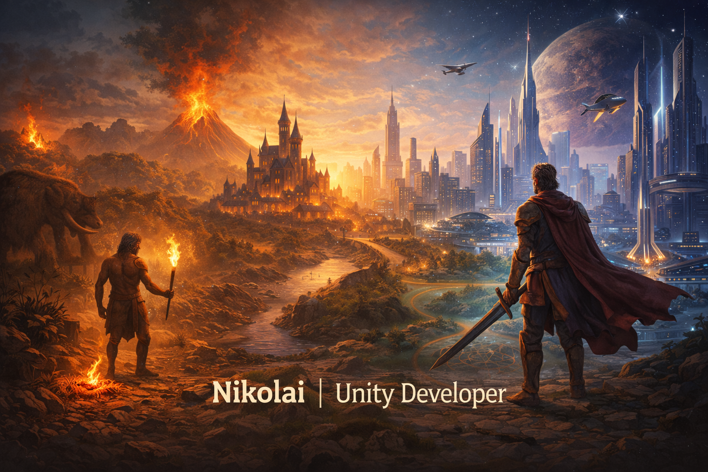

  

<h1 align="center">Nikolai | Unity Developer</h1>

🎮 Game Developer • Unity • C# • Gameplay & Architecture  

---

## 👋 About Me

Hi! I'm **Nikolai**, a **Unity Game Developer** with commercial experience in building games for **PC, Mobile and WebGL**.

I focus on:
- **clean architecture**
- **gameplay systems**
- **performance & optimization**
- **scalable and maintainable code**

I enjoy creating games where **systems interact**, mechanics evolve, and the project can grow without turning into spaghetti.

---

## 🧠 What I Do Best

- 🕹 **Gameplay programming** (movement, combat, progression, AI logic)
- 🧩 **System design** (inventory, resources, economy, meta-progression)
- 🏗 **Architecture** (SOLID, modular systems, ECS, state machines)
- ⚡ **Optimization** (mobile & WebGL, memory, GC, draw calls)
- 🧪 **Prototyping** (fast MVPs, test tasks, gameplay experiments)

---

## 🧰 Tech Stack

### Core

### Architecture & Patterns

### Additional

---

## 🚀 Featured Projects

| Project | Description | Link |
|-------|------------|------|
| 🏰 **Prototype** | Tower Defense game built with **Entitas ECS** | [GitHub](https://github.com/your-link) |
| ⚔ **Prototype** | Survivors-like action game built with **OOP** | [GitHub](https://github.com/your-link) |
| 🧪 **Test** | Playtest-ready Unity project with loot, healing, inventory, UI polish | [GitHub](https://github.com/your-link) |
| 🧊 **Prototype** | Physics-based prototype built in 2 days. Zenject, state machine, merge logic | [GitHub](https://github.com/your-link) |

---

## 📈 GitHub Stats

  
   
  

---

## 🎯 Currently Interested In

- Game systems with **depth and progression**
- Projects where **code quality matters**
- Teams that value **architecture & scalability**
- Mid-level Game Developer roles

---

## 🤝 Connect With Me

  
  
  

---

✨ Building gameplay systems, architecture and worlds — one feature at a time

